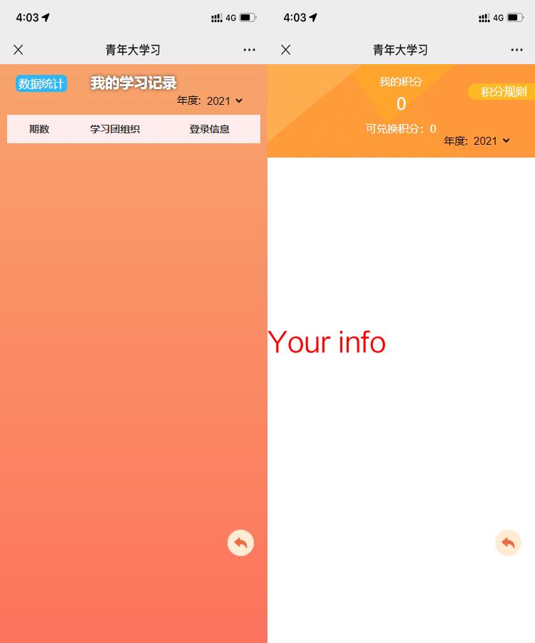
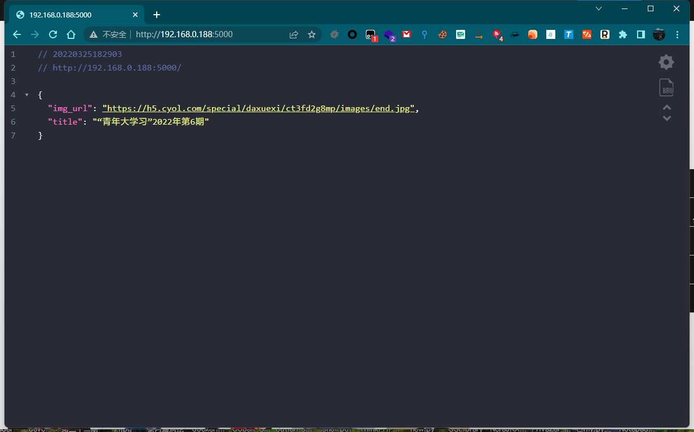
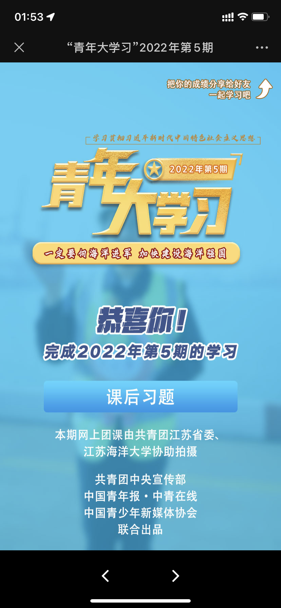

# 								青年大学习完成截图

<div align=center></div>

​																![](https://img.shields.io/badge/OS-Liuux-informational?style=plastic&logoColor=white&color=2bbc8a&logo=data:image/svg%2bxml;base64,PHN2ZyByb2xlPSJpbWciIHZpZXdCb3g9IjAgMCAyNCAyNCIgeG1sbnM9Imh0dHA6Ly93d3cudzMub3JnLzIwMDAvc3ZnIj48dGl0bGU+RWxlY3Ryb248L3RpdGxlPjxwYXRoIGQ9Ik0xMi4wMTExIDBjLS44NSAwLTEuNTM5Mi42ODkxLTEuNTM5MiAxLjUzOTIgMCAuODUwMS42ODkxIDEuNTM5MyAxLjUzOTIgMS41MzkzLjU5NSAwIDEuMTEtLjMzOCAxLjM2NjItLjgzMiAyLjIyMDggMS4yNjc1IDMuODQ3IDUuNDcyOCAzLjg0NyAxMC4zNjIzIDAgMi4wNzE1LS4yODkxIDQuMDU2LS44MjUgNS43Njg1YS4zMjE1LjMyMTUgMCAwIDAgLjIxMDcuNDAzLjMyMi4zMjIgMCAwIDAgLjQwMzMtLjIxMTFjLjU1NTgtMS43NzYzLjg1NDItMy44MjUxLjg1NDItNS45NjA0IDAtNS4xOTI3LTEuNzcxNy05LjY4Ni00LjMyMDYtMTEuMDAyNy4wMDEtLjAyMjMuMDAzNS0uMDQ0My4wMDM1LS4wNjY5IDAtLjg1LS42ODkxLTEuNTM5Mi0xLjUzOTMtMS41Mzkyem0wIC42NDMyYS44OTYuODk2IDAgMSAxIDAgMS43OTIuODk2Ljg5NiAwIDEgMSAwLTEuNzkyem0tNS40ODYgNC4zMDUyYy0yLjA2Ny4wMDc0LTMuNjQ3My42NjQ2LTQuMzg4NSAxLjk0ODUtLjczNzUgMS4yNzc0LS41MjY3IDIuOTcxLjUxMTMgNC43ODEzYS4zMjE3LjMyMTcgMCAwIDAgLjU1OC0uMzJDMi4yNzEgOS43Mjc0IDIuMDg5IDguMjY2IDIuNjkzOCA3LjIxODVjLjgyMS0xLjQyMiAzLjAzMy0xLjk1NTIgNS45MzIxLTEuNDI3MWEuMzIxNi4zMjE2IDAgMCAwIC4xMTUzLS42MzI5Yy0uNzg0LS4xNDI4LTEuNTI3MS0uMjEyNS0yLjIxNi0uMjF6bTExLjA1MjIuMDE3NmEuMzIxNi4zMjE2IDAgMCAwLS4wMDg0LjY0MzJjMS44MzM3LjAyMzkgMy4xNTU2LjU5NTYgMy43NTAyIDEuNjI1Ni44MTkyIDEuNDE5LjE3OTggMy41OTQ3LTEuNzE4MiA1LjgzN2EuMzIyLjMyMiAwIDAgMCAuMDM3Ny40NTM1LjMyMTUuMzIxNSAwIDAgMCAuNDUzMi0uMDM3N2MyLjA1MzUtMi40MjYgMi43NzA4LTQuODY2MSAxLjc4NDUtNi41NzQ0LS43MjU3LTEuMjU3LTIuMjYtMS45MjA3LTQuMjk5LTEuOTQ3MnptLTIuNjk4NC4yOTI0YS4zMjI1LjMyMjUgMCAwIDAtLjA2NDcuMDA3MmMtMS44NTY4LjM5NzktMy44MzMzIDEuMTc1NS01LjczMTQgMi4yNzE0LTQuNTY5OSAyLjYzODQtNy41OTI0IDYuNDk0OC03LjM2MDEgOS4zNzE3LS40NzI2LjI2MjgtLjc5MjguNzY2NC0uNzkyOCAxLjM0NTUgMCAuODUuNjg5MiAxLjUzOTIgMS41MzkzIDEuNTM5Mi44NSAwIDEuNTM5Mi0uNjg5MSAxLjUzOTItMS41MzkyIDAtLjg1MDEtLjY4OTEtMS41MzkzLTEuNTM5Mi0xLjUzOTMtLjAzOCAwLS4wNzU0LjAwMy0uMTEyOC4wMDU3LS4xMDAyLTIuNTU5NyAyLjc0MzQtNi4xNDEyIDcuMDQ4LTguNjI2NSAxLjg0MTMtMS4wNjMgMy43NTUxLTEuODE2MyA1LjU0NDUtMi4xOTk3YS4zMjE3LjMyMTcgMCAwIDAtLjA3LS42MzZ6bS0yLjg3ODcgNi4yMzY0YTEuMTE5MiAxLjExOTIgMCAwIDAtLjIyNDMuMDI1NWMtLjYwMTIuMTMwMS0uOTgzLjcyMjUtLjg1MzMgMS4zMjM4LjEzMDIuNjAxMi43MjI2Ljk4MzIgMS4zMjM4Ljg1MzMuNjAxMi0uMTMwMi45ODMyLS43MjI2Ljg1MzMtMS4zMjM4LS4xMTM5LS41MjYtLjU4MTYtLjg4NDQtMS4wOTk1LS44Nzg4ek00LjUzMiAxMy4zNDFhLjMyMS4zMjEgMCAwIDAtLjIzMTguMDgzNS4zMjE0LjMyMTQgMCAwIDAtLjAyMTQuNDU0MmMxLjI2ODIgMS4zOTM2IDIuOTE1NyAyLjcwMSA0Ljc5NDYgMy43ODU3IDQuNDE0NiAyLjU0ODkgOS4xMDU2IDMuMjg0OSAxMS41NjA4IDEuODM5MmExLjUzIDEuNTMgMCAwIDAgLjg5NjYuMjg5OWMuODUwMSAwIDEuNTM5Mi0uNjg5MSAxLjUzOTItMS41MzkyIDAtLjg1MDEtLjY4OS0xLjUzOTMtMS41MzkyLTEuNTM5My0uODUgMC0xLjUzOTIuNjg5Mi0xLjUzOTIgMS41MzkzIDAgLjI3Ni4wNzM3LjUzNDQuMjAxLjc1ODQtMi4yNDQ4IDEuMjE0LTYuNjMxLjUwMDItMTAuNzk3Ni0xLjkwNTQtMS44MjI4LTEuMDUyNC0zLjQxOC0yLjMxODEtNC42NDA0LTMuNjYxNGEuMzIwNi4zMjA2IDAgMCAwLS4yMjI2LS4xMDQ5em0tMi4wNjI4IDQuMDE3MmEuODk2Ljg5NiAwIDEgMSAwIDEuNzkyLjg5Ni44OTYgMCAxIDEgMC0xLjc5MnptMTkuMDYxNiAwYS44OTYuODk2IDAgMSAxIDAgMS43OTIuODkxLjg5MSAwIDAgMS0uNTg2NC0uMjE5NGMtLjAwMjUtLjAwNC0uMDAzOS0uMDA4My0uMDA2Ni0uMDEyM2EuMzE5NS4zMTk1IDAgMCAwLS4wOTU3LS4wOTE0Ljg5Ni44OTYgMCAwIDEgLjY4ODctMS40Njg5em0tMTQuMDA0NSAxLjM2OGEuMzIxNS4zMjE1IDAgMCAwLS4zMjA3LjQyOTZDOC4yNzkzIDIyLjE1NCAxMC4wMzYgMjQgMTIuMDExMSAyNGMxLjQ0MDYgMCAyLjc3MzUtLjk4MjIgMy44MTI4LTIuNzExYS4zMjE1LjMyMTUgMCAwIDAtLjExLS40NDEzLjMyMTkuMzIxOSAwIDAgMC0uNDQxNS4xMWMtLjkzNCAxLjU1MzctMi4wODEyIDIuMzk5LTMuMjYxMyAyLjM5OS0xLjY0MDcgMC0zLjIwNzUtMS42NDY1LTQuMi00LjQxNzlhLjMyMTYuMzIxNiAwIDAgMC0uMjg0OC0uMjEyNnoiLz48L3N2Zz4=)	

------

🤖 使用 `go-CQHttp`QQ机器人做推送

> 机器人项目地址
>
> <https://github.com/Mrs4s/go-cqhttp>

🚀由于青年大学习网站屏蔽了云服务的 `ip`，所以在服务器上运行时需要使用代理，代理使用 `proxy_pool`代理池

> proxy\_pool代理项目地址
>
> <https://github.com/jhao104/proxy_pool>

***

### 使用

> - **使用前请阅读[Notice](#notice)**
>
> 以下操作基于`linux`  以下操作基于`linux`  以下操作基于`linux`
>
> 向机器人QQ发送关键字即可获取截图
>
> 周一下午1点后会自动完成本次观看任务
>
> 访问 `http://你的ip:6106/`或 `http://你的ip:6106/img/`即可获取视频完成图片链接或截图
>
> 机器人获取截图样式
> 

***

### 配置

> 1.  抓取本人的青年大学习 `openid`值
>
> > 🍎IOS用户可使用Stream进行抓取
> >
> > > 1.  在设置里设置 `HTTPS`抓包
> > >
> > > 2.  设置抓包模式为白名单模式
> > >
> > > 3.  添加抓包域名 `*.youth54.cn`
> > >
> > > 4.  开启抓包访问青年大学习
> > >
> > > 5.  筛选抓包历史中的 `POST`请求可以找到 `openid`
> >
> > 😊 安卓系统可以使用`HttpCanary`进行抓包（可能需要root）
> >
> > > 1. 在主界面点击加号选择微信
> > > 2. 开启抓包访问青年大学习
> > > 3. 在抓包历史中搜索youth54.cn，找到`POST`请求可以找到`openid`
> > >
> > > 你也可以选择使用电脑微信抓包
> > >
> > > 具体细节`百度谷歌`
>
> 1.  关于 `config.py`
>
> > `info` –> 你需要在图片上添加的水印信息
> >
> > `openid` –>你抓取到的 `openid`
> >
> > `proxyPool_url`  –>代理池地址，无需修改
> >
> > `Keyword` –>机器人触发关键字
>
> 1.  配置机器人
>
> > 配置 `dxx/qbot/config.yml`文件
> >
> > `uin`:  # QQ账号
> >
> > `password`  # QQ密码

### 搭建

🐳安装 `docker`以及 `docker-compose`

> `docker`换源自行搜索

```bash
git clone https://github.com/captain686/young-study.git
cd young-study
git clone https://github.com/jhao104/proxy_pool.git
mv proxy.yml -f proxy_pool/docker-compose.yml
cd proxy_pool && docker-compose up -d
cd ../ && docker-compose up -d
```

### 查看docker容器运行结果

```bash
docker ps
```

### 全部正常运行后进入青年大学习的主环境

```bash
docker exec -it $(docker ps|grep qndxx|awk '{print $1}') /bin/bash
```

### 配置机器人

> 注意：`qbot`文件夹中已经附带 `go-CQHttp`二进制文件，如想使用其他版本请在自行下载，并将 `go-CQHttp`二进制文件放置在 `dxx/qbot`目录下即可

```bash
cd qbot && chmod 777 go-cqhttp
```

```bash
./go-cqhttp
```

> `bash go-cqhttp`命令为启动机器人命令，关闭窗口时机器人会退出，可以使用进程守护执行程序，命令如下

```bash
nohup ./go-cqhttp > /home/dxx/DxxLog/cqhttp.log 2>&1 &
```

> 查看 `cqhttp.log`文件看机器人需不需要登陆验证

```bash
cat cqhttp.log
```

> 如果提示扫码登陆可将本目录下的 `png`文件下载到本地扫码登陆

### 关于视频最后截图

如果你只需要视频最后截图那你并不需要配置机器人

你只需要在微信里面访问

`http://你的ip:6106/`或 `http://你的ip:6106/img/`即可

> 😃`http://你的ip:6106/` 返回图片链接;
>
> 
>
> 🙈`http://你的ip:6106/img/`
> 返回图片
> 

## Notice

由于各个地区采用的公众号不同无法确保每个地区都可使用（视频最后截图功能都可正常使用），具体可使用情况请自测，烦请将自测结果添加到此[**`issues #19`**](https://github.com/captain686/Youth-Learning/issues/19)中以便供他人查看

## Update

### 2020-3-25

> 优化了观看结尾截图页面样式，如图，本次更新提供两个版本模板，详细配置请看`config.py`
>
> 默认采取`img`模板，请根据自己需求更改
>
> 

### 😊 `To DO`

- [ ] 一个新的想法：使用`github Actions`来完成整套流程，你只需要`fork`本仓库然后再配置个人信息即可使用，截图通过邮箱推送，摆脱没有服务器的限制

### 👼 bug请提issues
